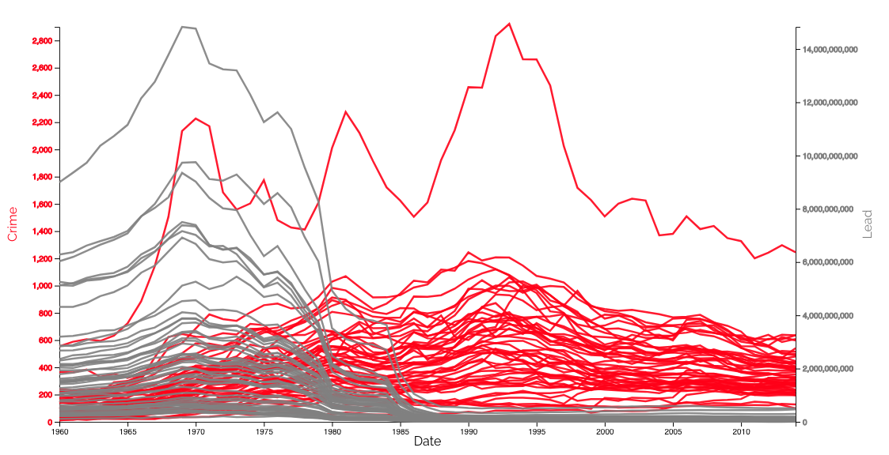
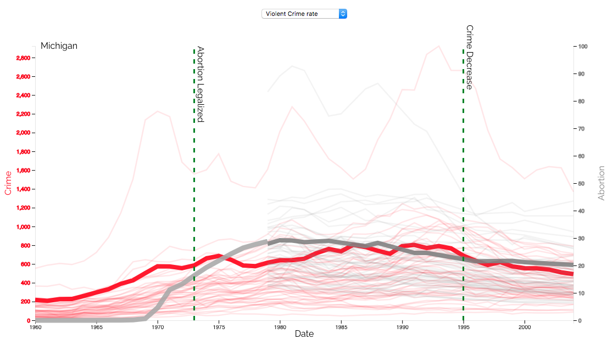
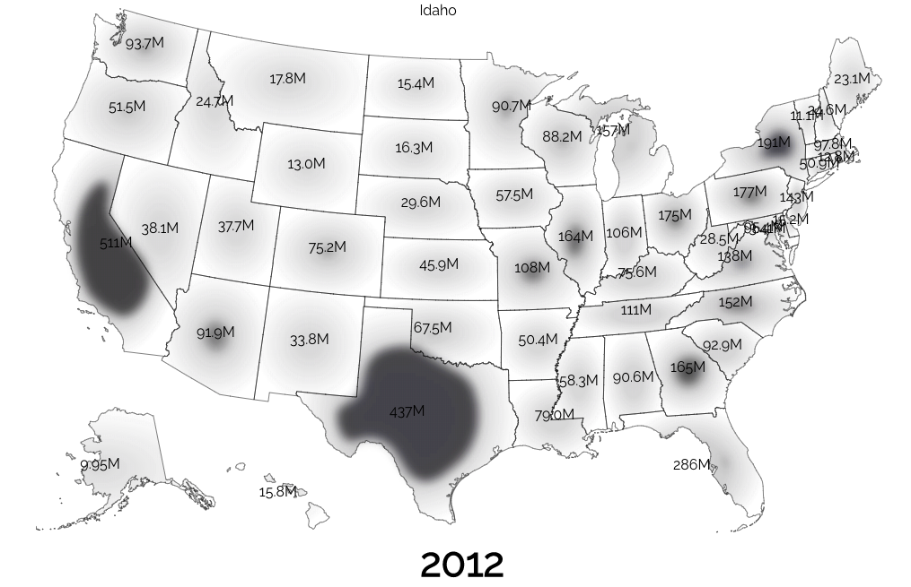

# Final Project - Interactive Data Visualization  
### Kit Zellerbach and Jacob Kaplan - Crime Over Time

Website Link: 

https://qwertey6.github.io/crime-over-time/ or [here](https://qwertey6.github.io/crime-over-time/)

## Requirements

This README/repo includes:
- Code in src folder
- Data in src/data folder
- Process Book

We only used d3.js and React. Most of the code was written from scratch.

## Features
- Clicking Lines to select specific states
- Automatic Scaling to selected data
- Custom Matrix/Blur Equations for cloud map animation
- Hovering over Lines to highlight specific states
- Double Click on Abortion vs. Crime SVG to scale data 18 years back for easier comparison
- Double Click on Lead vs. Crime to reset to normal
- Hovering over Cloud Map States to see state name
- Cloud Map Timeline to control animation
- Data vis accompanied with explanatory text and images

Lead vs. Crime

Abortion vs. Crime

Lead over Time

## Milestone
For the Milestone, we presented our fully functional website. The website was an interactive data visualization that allows
 users to explore various hypothesised explanations of drops in US crime rates. This visualization was
 centered around exploring and explaining the drop in crime due to the phasing out of lead in fuel from the Clean Air Act of 1970,
 as well as the legalization of abortion in 1973.

